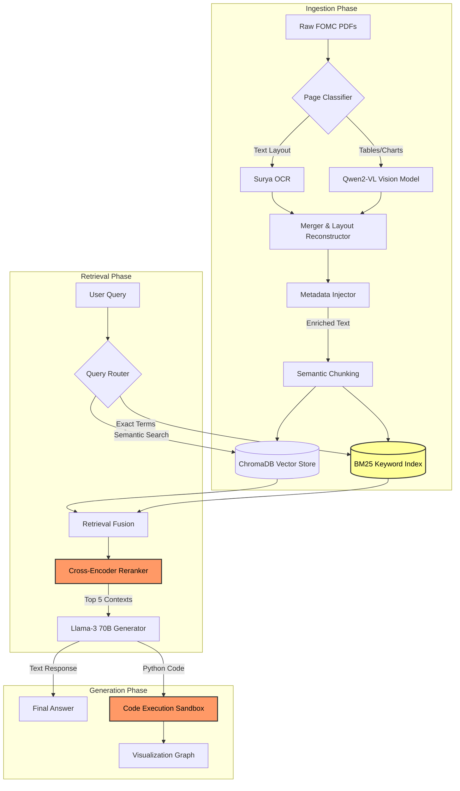

# FOMC RAG: Hybrid Extraction & Retrieval System

This repository contains the core architecture for a Retrieval-Augmented Generation (RAG) pipeline designed specifically for complex financial documents (FOMC minutes). 

This is the public release of the **base system**. While the internal project includes uncertainty quantification, red-teaming, and teacher-model grading, this repository focuses solely on the ingestion, hybrid extraction, and vector retrieval pipelines.

## The Problem
Standard OCR tools fail on FOMC documents because they rely heavily on dense tables and mixed-column layouts. To solve this, I built a hybrid extractor that routes simple text pages to high-speed OCR and complex table pages to a Vision Language Model (VLM).

## System Architecture

I used **Surya** for layout detection and **Qwen2-VL** for extracting data from economic projection tables. The retrieved context is fed into **Llama 3** for generation.

